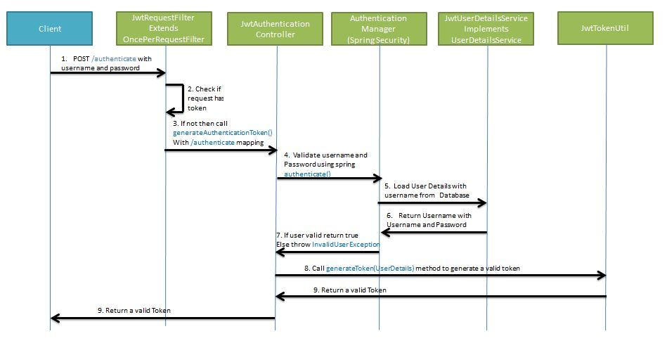
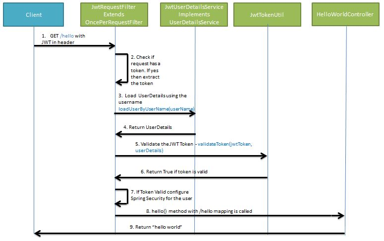

# Architecture


* **SecurityContextHolder** 

  * 현재 보안 컨텍스트에 대한 세부 정보가 저장됨

* **SecurityContext**

  * Authentication을 보관하는 역할
  * 이를 통해 Authentication 객체를 꺼내올 수 있음

* **Authentication**

  * 현재 접근하는 주체의 정보과 권한을 담는 인터페이스
  * SecurityContextHolder를 통해 SecurityContext에 접근, SecurityContext를 통해 Authentication에 접근

* **UsernamePasswordAuthenticationToken**

  * *Authentication을 implements한 AbstractAuthenticationToken의 하위 클래스*
  * User의 ID가 Principal역할, Password가 Credential역할
  * 내부적으로 UserDetailsService를 사용...? 확인필요

* **AuthenticationProvider**

  * 실제 인증에 대한 부분을 처리

  * 인증 전의 Authentication객체를 받아서 인증이 완료된 객체를 반환하는 역할

  * 아래와 같은 AuthenticationProvider 인터페이스를 구현해서 Custom한 AuthenticationProvider를 작성해서 AuthenticationManager에 등록하면 된다.

    ```java
    public interface AuthenticationProvider{
        Authentication authenticate(Authentication authentication) throw AuthenticationException;
        
        boolean supports(Class<?> authentication);
    }
    ```

* **AuthenticationManager**(interface)

  * 인증에 대한 부분은 SpringSecurity의 AuthenticationManager를 통해서 처리

  * 사실 AuthenticationManager에 등록된 AuthenticationProvider에 의해 처리됨

  * 인증이 성공하면 2번째 생성자를 이용, 인증이 성공한 객체(isAuthenticated = true)를 생성하여 SecurityContext에 저장

  * 그리고 인증 상태를 유지하기 위해 세션에 보관

  * 실패하면 Exception

    ```java
    public interface AuthenticationManager{
        Authentication authenticate(Authentication authentication) throws AuthenticationException;
    }
    ```

  * ProviderManager에 직접 구현한 CustomAuthenticationProvider를 등록하는 방법

    * WebSecurityConfigurerAdapter를 상속해 만든 SecurityConfig에서 할 수 있다.
    * WebSecurityConfigurerAdapter의 상위 클래스에서는 AuthenticationManager를 가지고 있다
    * 그래서 우리가 직접 만든 CustomAuthenticationProvider를 등록할 수 있다.

    ```java
    @Configuration
    @EnableWebSecurity
    public class SecurityConfig extends WebSecurityConfigurerAdapter {
      
        @Bean
        public AuthenticationManager getAuthenticationManager() throws Exception {
            return super.authenticationManagerBean();
        }
          
        @Bean
        public CustomAuthenticationProvider customAuthenticationProvider() throws Exception {
            return new CustomAuthenticationProvider();
        }
        
        @Override
        protected void configure(AuthenticationManagerBuilder auth) throws Exception {
            auth.authenticationProvider(customAuthenticationProvider());
        }
    }
    ```

* **UserDetails**

  * 인증에 성공하여 생성된 UserDetails 객체

  * Authentication객체를 구현한 UsernamePasswordAuthenticationToken을 생성하기 위해 사용

  * UserVO 모델에 UserDetails를 implements하여 처리하거나

  * UserDetailsVO에 UserDetails를 implements하여 처리할 수 있다.

    ``` java
    public interface UserDetails extends Serializable {
    
        Collection<? extends GrantedAuthority> getAuthorities();
        String getPassword();
        String getUsername();
        boolean isAccountNonExpired();
        boolean isAccountNonLocked();
        boolean isCredentialsNonExpired();
        boolean isEnabled();
        
    }
    ```

* **UserDetailsService**(interface)

  * 일반적으로 이를 구현한 클래스의 내부에 UserRepository를 주입받아 DB와 연결하여 처리

  * ```java
    public interface UserDetailsService {
    
        UserDetails loadUserByUsername(String var1) throws UsernameNotFoundException;
    
    }
    ```

* **PasswordEncoding**

  * AuthenticationManagerBuilder.userDetailsService().passwordEncoder()를 통해 패스워드 암호화에 사용될 PasswordEncoder 구현체를 지정할 수 있다.

  * WebSecurityConfig에서

    ```java
    @Override
    protected void configure(AuthenticationManagerBuilder auth) throws Exception {
    	// TODO Auto-generated method stub
    	auth.userDetailsService(userDetailsService).passwordEncoder(passwordEncoder());
    }
    
    @Bean
    public PasswordEncoder passwordEncoder(){
    	return new BCryptPasswordEncoder();
    }
    ```

* **GrantedAuthority**

  * GrantAuthority는 현재 사용자(Pricipal)가 가지고 있는 권한
  * ROLE_ADMIN, ROLE_USER와 같이 ROLE_*의 형태로 사용
  * 보통 roles라고 함
  * UserDetailsService에 의해 불러올 수 있음
  * 특정 자원에 대한 권한이 있는지를 검사하여 접근 허용 여부를 결정

* **LoginSuccessHandler**(extends SavedRequestAwareAuthenticationSuccessHandler ... )

  * AuthenticationProvider를 통해 인증이 성공될 경우 처리

  * 토큰을 사용하지않고 세션을 활용하는 예제, 이경우 성공하여 반환된 Authentication객체를 Context에 저장해주어야 함 (나중에 사용자의 정보를 꺼낼 경우에도 Context에서 조회하면 된다)

    ```java
    public class CustomLoginSuccessHandler extends SavedRequestAwareAuthenticationSuccessHandler {
    
        @Override
        public void onAuthenticationSuccess(HttpServletRequest request, HttpServletResponse response,
                                            Authentication authentication) throws IOException {
            SecurityContextHolder.getContext().setAuthentication(authentication);
            response.sendRedirect("/about");
        }
    
    }
    ```


---

* **CustomAuthenticationFilter**

  * WebSecurityConfig에서 빈으로 등록?
  * 빈으로 등록하는 과정에서 Username, UserPw 파라미터를 설정할 수 있다.
  * UsernamePasswordToken을 AuthenticationManager에 전달

* **CustomAuthenticationProvider**

  * AuthenticationManager는 전달받은 UsernamePasswordToken을 순차적으로 AuthenticationProvider들에게 전달하여 실제 인증과정을 수행해야 함

  * 실제 인증에 대한 부분은 authenticate 함수에 작성을 해주어야 한다.

    * token.getName()을 userDetailsService를 통해 조회
    * token.getCredentials()를 조회 결과로 반환된 password와 passwordEncoder를 통해 매칭
    * 실패하면 BadCredentialsException
    * jwt토큰의 경우 어떻게??

  * 이렇게 완성된 Provider를 Bean으로 등록해주어야 함

  * ```java
    @Bean
    public CustomAuthenticationProvider customAuthenticationProvider(){
        return new CustomAuthenticationProvider(passwordEncoder());
    }
    ```

* **UserDetailsServiceImpl**

  * UserDetails(interface) 반환

  * ```java
    @Override
    public UserDetailVO loadUserByUsername(String userEmail){
        return userRepository.findByUserEmail(userEmail)
            .map(u -> new UserDetailsVO(u, Collections.singleton(
            new SimpleGrantedAuthority(u.getRole().getValue())))).roElseThrow(
            () -> new UserNotFoundException(userEmail));
    }
    // Optional로 반환하기 때문에 .map 함수를 이용해 새로운 UserDetailsVO객체로 생성하여 반환
    ```

* **인증된 토큰을 AuthenticationFilter에게 전달**

  * Provider에서 인증이 완료된 UsernamePasswordAuthenticationToken을 AuthenticationFilter로 반환하고 AuthenticationFIlter에서는 LoginSuccessHandler로 전달

* **SecurityContextHolder 저장**

  * LoginSuccessHandler로 넘어온 Authentication 객체를 SecurityContextHolder에 저장하면 인증과정은 끝
  * jwt를 쓴다면??


여기까지 jwt, redis를 제외한 예제

---


## JWT, Redis를 추가하는 예제

* **이전 예제에서 filter들에 JWT처리를 위해 조금씩 커스터마이징**

* **Generate JWT Flow**

  * 각 네모는 CustomFilter
  
    

* **Validating JWT Flow**
  
  * 

* **RedisConfig**

  * SpringBoot 2.0부터는 redisConnectionFactory, RedisTemplate, StringTemplate 빈들이 자동으로 생성되어 굳이 Configuration을 만들지 않아도 사용 가능하다고 함

  * **RedisConnectionFactory**

    * Redis 서버와의 통신을 위한 low-level 추상화 제공
    * 설정에 따라서 새로운 RedisConnection 또는 이미 존재하는 RedisConnection을 리턴
    * RedisConnection은 Redis 서버와의 통신 추상화를 제공, Exception 발생 시 SpringDataAccessException으로 전환.
    * RedisConnection은 Binary Value를 인자로 받고 결과를 리턴하는 low-level method를 리턴
    * **Jedis**, Jredis(1.7 Deprecated), **Lettuce**, SRP, RJC 등의 클라이언트 라이브러리가 있음.

  * **RedisTemplate**

    * Redis 서버에 RedisCommand를 수행하기 위한 high-level 추상화 제공
    * 객체 직렬화와 connection management를 수행
    * Redis 서버에 데이터 crud를 위한 key type operations와 key bound operations 인터페이스 제공
    * thread-safe하며, 재사용 가능
    * 대부분의 기능에 RedisSerializer 인터페이스 사용
    * Redis에 저장된 키와 값이 java.lang.String이 되도록 하는 것이 일반적이므로 StringRedisTemplate 확장 기능 제공
    * StringRedisSerializer를 사용, 저장된 키와 값은 사람이 읽을 수 있음

  * ```java
    @Configuration
    public class RedisConfig {
    
        @Bean
        public RedisConnectionFactory redisConnectionFactory() {
            LettuceConnectionFactory lettuceConnectionFactory = new LettuceConnectionFactory();
            return lettuceConnectionFactory;
        }
    
        @Bean
        public RedisTemplate<String, Object> redisTemplate() {
            RedisTemplate<String, Object> redisTemplate = new RedisTemplate<>();
            redisTemplate.setConnectionFactory(redisConnectionFactory());
            redisTemplate.setKeySerializer(new StringRedisSerializer());
            redisTemplate.setValueSerializer(new StringRedisSerializer());
            return redisTemplate;
        }
    
        @Bean
        public StringRedisTemplate stringRedisTemplate() {
            StringRedisTemplate stringRedisTemplate = new StringRedisTemplate();
            stringRedisTemplate.setKeySerializer(new StringRedisSerializer());
            stringRedisTemplate.setValueSerializer(new StringRedisSerializer());
            stringRedisTemplate.setConnectionFactory(redisConnectionFactory());
            return stringRedisTemplate;
        }
    
    }
    ```

  * application.properties

    * ```properties
      spring.redis.lettuce.pool.max-active=10
      spring.redis.lettuce.pool.max-idle=10
      spring.redis.lettuce.pool.min-idle=2
      spring.redis.port=6379
      spring.redis.host=127.0.0.1
      ```


# Ref

> https://mangkyu.tistory.com/76
>
> https://mangkyu.tistory.com/77
>
> https://jeong-pro.tistory.com/205 - 로그인 과정 아키텍처
>
> https://velog.io/@tlatldms/Spring-boot-Spring-security-Jwt-1-fvk5hlol8u - Redis, JWT  추가
>
> https://ssoco.tistory.com/19 - springboot, redis 연동


* **Redis**
  * java client library는 크게 두가지 Jedis, Lettuce
  * 근데 Lettuce가 성능 훨씬 좋음
  * https://jojoldu.tistory.com/418 참고